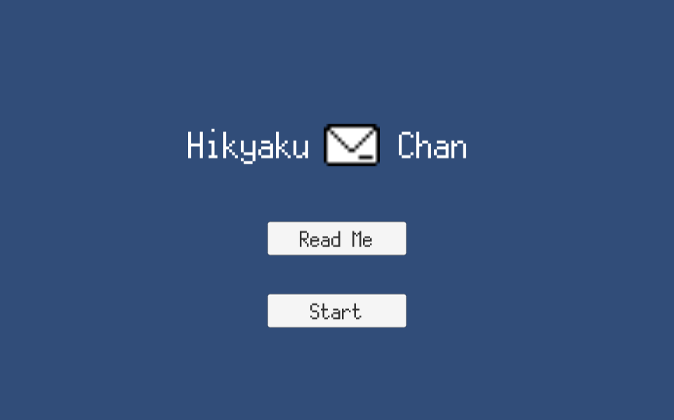

## Unity1週間ゲームジャムとは？
「[Unity1週間ゲームジャム](https://unityroom.com/unity1weeks)」とは、Unityを使って1週間でゲームをつくるイベントです。

毎回異なるお題が与えられます。お題は多少こじつけでも大丈夫なようです。

先週、とある研究室のOBの方から存在を教えてもらいました！

今回は、「つたえる」がお題でした。

## Hikyaku Chan
今回私が製作したゲームは「[Hikyaku Chan](https://unityroom.com/games/hikyakuchan)」です。作品名をクリックすると遊べるWebページに飛びます。

古典的な横スクロールのアクションゲームです。

### ゲーム紹介

世は江戸時代の日本。
郵便物は「飛脚」と呼ばれる人が足で運んでいた。
ユニティちゃんを操作してできるだけ速く郵便物をゴールまで運ぼう!
道中にある「おにぎり」を食べると足が速くなるぞ!

※作成したゲームを紹介する文書か記事は別で書こうと思います。

## 製作するまでの過程

私はUnity初心者（いくつかの本のサンプルゲーム作成や簡単なVRゲームを作成した程度）であり、凝ったゲームや特殊なジャンルは作れないと考えました。

始めたのも遅く、時間があるわけではなかったため、横スクロールのアクションゲームなら現実的に作れそうだなと考えました。

***つたえる ⇒ 情報を伝える ⇒ 手紙などを運ぶ***

と連想ゲームをし、**伝書バト**や**飛脚**という案が浮かびました。

気づいたのが遅かった、他の用事があった、企画がなかなか思いつかない、Unity初心者ということで大変苦労しました。期日までには完成することが出来ず、一日遅れで何とか遊べるまで持って行って投稿しました。いくつか把握しているバグはあるものの原因や解決方法が分からなかったという理由とお蔵入りにしたくなかったという理由で公開することにしました。

## 感想
出来ていくにつれて、どんどん入れたい要素が出てきました。

投稿する日は朝からPCに張り付いて作業をしました。

拙い本作ですが、遊べるまで完成したとき、達成感がとても得られ、参加してよかったと思いました！

次回も参加します！（宣言）