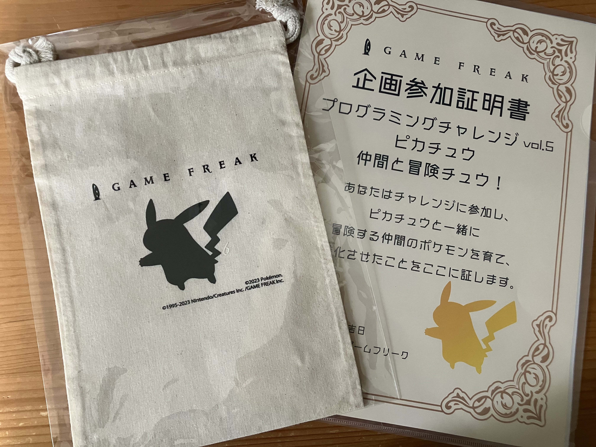

先月、ゲームフリークさんの「ゲームフリーク・プログラミングチャレンジ-ピカチュウ仲間と冒険チュウ！-」にチャレンジしました。

<blockquote class="twitter-tweet">
【ゲームフリーク プログラマ新卒採用】 全学年対象の採用企画 「プログラミングチャレンジ -ピカチュウ仲間と冒険チュウ！-」開催決定！ 一緒に冒険する仲間のポケモンを育てて、進化させよう！  ▼企画詳細はこちら(参加者限定特典あり)<a href="https://t.co/1XAMJNdLgv">https://t.co/1XAMJNdLgv</a><a href="https://twitter.com/hashtag/%E3%83%94%E3%82%AB%E3%83%81%E3%83%A5%E3%82%A6%E5%86%92%E9%99%BA%E3%83%81%E3%83%A5%E3%82%A6?src=hash&amp;ref_src=twsrc%5Etfw">#ピカチュウ冒険チュウ</a>　<a href="https://twitter.com/hashtag/%E3%83%97%E3%83%AD%E3%82%B0%E3%83%A9%E3%83%9E?src=hash&amp;ref_src=twsrc%5Etfw">#プログラマ</a>
&mdash; ゲームフリーク公式 (@GAMEFREAK_info) <a href="https://twitter.com/GAMEFREAK_info/status/1620641909726416896?ref_src=twsrc%5Etfw">February 1, 2023</a></blockquote> 

ある一定のスコアを取得できたので参加得点を頂きました！

