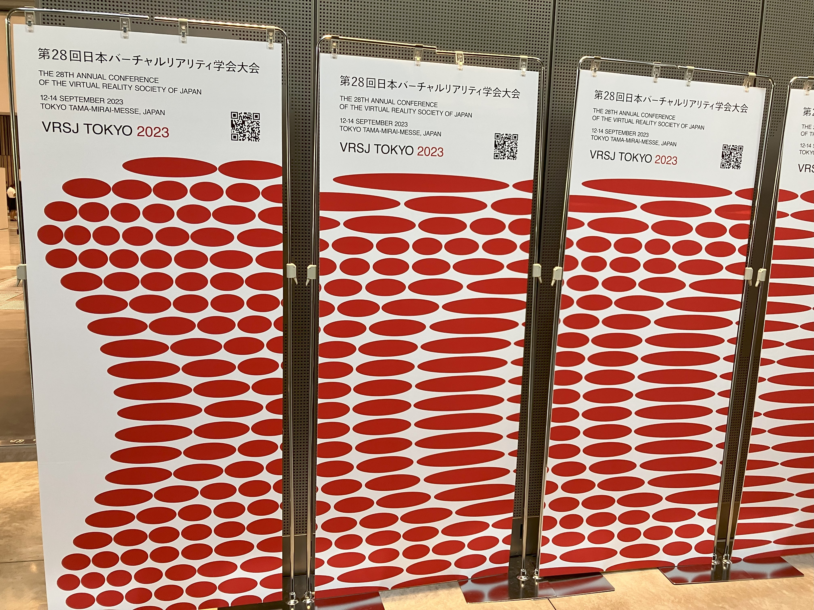

先日行われた[第28回日本バーチャルリアリティ学会大会](https://conference.vrsj.org/ac2023/index.html)で研究発表を行いました。  
ポスター発表２件、技術・芸術展示が１件と中々ハードでした。  
技術・芸術展示では装置が途中で破損し、修復に３０分ほどかかってしまったことと、私のポスター発表で、極度に緊張して質問者の話が全く入ってこなかった時があったため、猛省しています...

今年は、口頭発表（３分）＋ポスター発表（1時間以上）という発表形式であり、口頭発表で気になった研究についてポスター発表でじっくり説明を聞きに行く人が多かったのではないかと思います。説明する立場ではお客さんの反応を見ながら説明でき、聴きに行く立場ではその場で質問できるためとても良いなと思いました。  

しかし、少し残念だと感じたこともあります。私の技術・芸術展示は暗室という特別な部屋で行いました。しかし、この暗室は、通常の技術・芸術展示の部屋からかなり離れており、会場に道案内がなかったため、あまりお客さんが来ませんでした。

一方で、光学の研究を行っている学生と仲良くなることができ、嬉しかったです。私の研究は情報系からかなり離れており、研究の話が出来る人が全然いませんでした。そのため、同じ分野での苦労やあるある話で大変盛り上がり、研究へのモチベーションが高まりました。仲間を見つけることができるという点で学会へは積極的に行くべきだと実感しました。そのためには、研究を頑張る必要がありますが...

来年のVR学会大会は愛知の名城大で行われるそうです。岐阜大木島研も駆り出されるのかな？その時は、喜んで協力します！  
来年も研究発表が出来るように研究を頑張ります！！！！

Webで原稿が公開されたため、URLや動画を載せておきます。  
今回で私の学会/研究会での研究発表回数が4回になりました！弊学の同期で一番多いのではないだろうか...
- [アイトラッキングによるアイボックス追従を備えたマクスウェル視ディスプレイ](https://conference.vrsj.org/ac2023/program/doc/2D1-03.pdf)  
<iframe width="560" height="315" src="https://www.youtube.com/embed/X7NHAN3Mo2M?si=OdFPeOL0fBl3SLOO" title="YouTube video player" frameborder="0" allow="accelerometer; autoplay; clipboard-write; encrypted-media; gyroscope; picture-in-picture; web-share" allowfullscreen></iframe>

- [視焦点の移動によるボケの変化勾配の有無が融像困難性に与える影響](https://conference.vrsj.org/ac2023/program/doc/3B1-04.pdf)