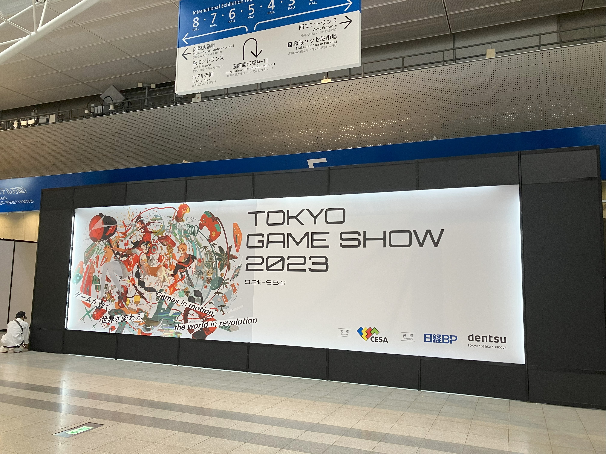
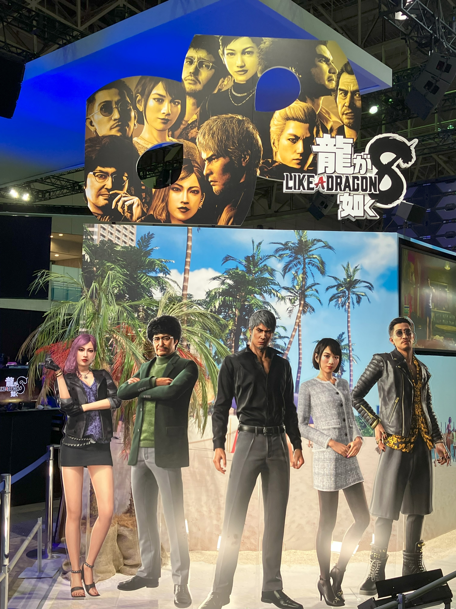
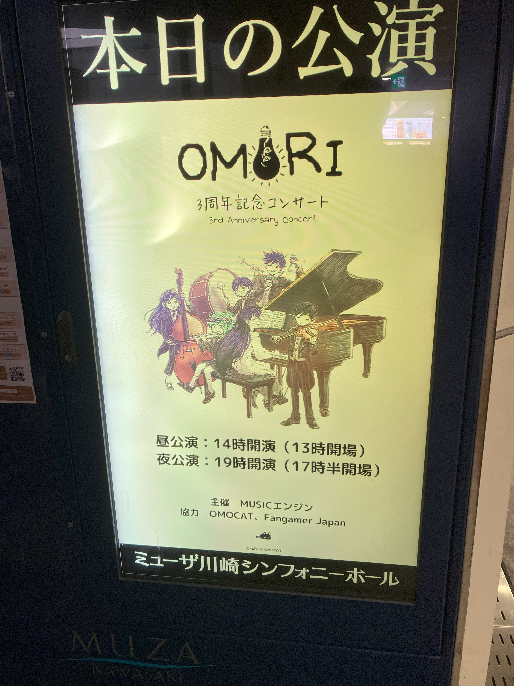
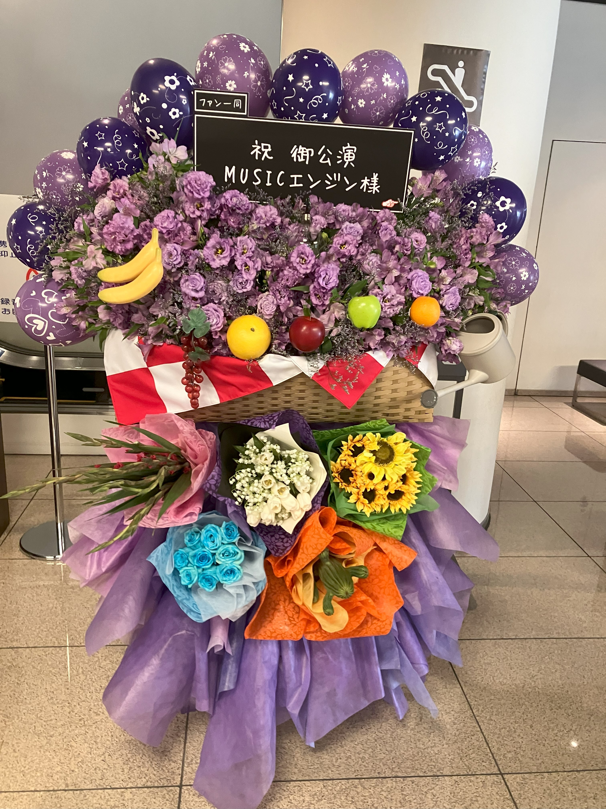

Blogの更新をせず、かなり時間が経った。全く何もしていなかったわけでなく、どちらかというと忙しくて更新できなかった。そのため、前回の更新から今まで何をしていたのか今回まとめて報告を行いたい。

## OBJ File Viewerの完成
8月から制作していたDirectX12を使用したobjファイルのビューワーだが、11月上旬に一応完成した。本当に制作に苦労した…  
機能は、SRT(Position, Rotation, Scale)の変更やPhongの反射モデルのパラメータ(アンビエント光, ディフューズ光, スペキュラー光, 透過度, スペキュラーの強さ)の変更、テクスチャの変更が行える。objファイルだけでなく、同名のmtlファイルがあるときはそのパラメータがPhongの反射モデルに適応される。  
Unityの画面を意識して制作した。

## Tank2を制作中
学部2年生の頃に制作したTankのリメイク。Unityで製作中。  
旧タンクでは技術や知識がなくうまく実装できなかった**ゲームAI**に拘って制作した。
どういう実装をおこなったかはPortfolioのTank2の方で述べたい。  
[ここから](https://unityroom.com/games/tank_sny)遊べるので是非遊んでほしい。

## データサイエンティスト育成事業に参加
岐阜大学には[データサイエンティスト育成事業](https://sites.google.com/db.info.gifu-u.ac.jp/ds2021/)という超スマート社会のデータサイエンティストに必要な3要素（実世界データ知識，ツールの活⽤スキル，異分野との協業マインド）の育成を⽬的としたプログラムがある。名古屋大学などと連携している取り組みで、詳しくは、上のリンク先を見て欲しい。企業や市町村から提供されたデータをチームで分析し、お悩みを解決する実践的な演習である。それに至るまでに、幾つもの講義の受講が必要となるが、一番大変なのはこの演習だろう。  
私は、2023年度このプログラムに参加した。前期にオンデマンドの講義を受け知識を付けたあと、後期（10月～1月）に先ほど述べたメイン演習を行った。私のチームは、名古屋大学院の学生や複数の社会人から構成された複合チームだった。週１～2回の会議（名駅の名大キャンパスやオンラインで）と裏で自分の分担した作業を進める必要があり、ゲーム制作と並行する必要があった私にとっては大変な期間だった。しかし、私の研究で使用していない（今後使用するかもしれない）機械学習技術を扱えたり、チームでの活発な活動を通じて多くの学びを得た。  
最終的には発表会があり、それが1月の中旬であったため、私の正月休みはこの準備で無くなってしまった…しかし、達成感は非常に大きく、楽しかったの事実だ。チームメイトには本当に感謝している。

## イベント参加
- Tokyo Game Show 2023

TGSに参戦。一般dayの一日目に参加したのだが、人が多すぎて移動がとても大変だった。開園前から1時間以上並んだのだが、新作ゲームのプレイチケットを獲得することができず、悔しい思いをした。しかし、私が楽しみにしている**龍が如く8**のディスプレイがきれいで興奮した。物販で欲しいグッズも買え大変満足した。来年はビジネスdayで行けるといいな…    
私は、こういうゲームのオフラインイベントに参加するのが大好きだ。住んでいる場所が岐阜であり、高額な出費が必要となるがその価値はあると思う。2023年の夏は、インディーゲームの祭典のBitSummitに行き、クリエーターの人とおしゃべりをしてきた。  

- OMORIコンサート

私が大好きなインディーゲームの一つ**OMORI**のコンサートに参戦した。私はOMORIのBGMが大好きでサントラも持っている。論文を執筆するときはいつもお世話になっている。だから、コンサートに参加しないという選択肢はない。春のコンサートは残念ながらチケットが当選せず行けなかったが、今回は運よく当選したのだ。  
コンサートは天国だった。特にWorld's End Valentineが最高だった。

↑OMORIのファンたちがお金を募って購入し送ったらしい。たくさんの人から愛されていることを実感した。