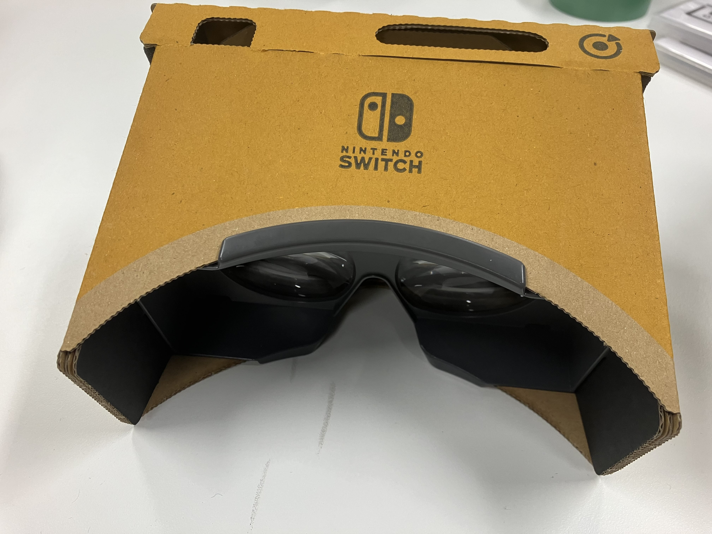

前回の更新からかなり時間が経ってしまった。この２，3カ月何をしていたかを記したい。

## Shader Arts製作
Unityのフラグメントシェーダーを書くことで様々な作品を制作した。  
数式を弄ることが面白く、短期間で40作品以上制作した。  
[ここに詳しく載せている](https://sny0.github.io/my-docusaurus/docs/shaderArts)

## 大人がNintendo Laboで遊ぶ
- [Nintendo Labo バラエティキット](https://www.nintendo.com/jp/labo/kit/variety.html)
- [Nintendo Labo VRキット](https://www.nintendo.com/jp/labo/kit/vr.html)

を購入し、Toy-Conを組み立てて遊んでみた。  
スゴイ…凄すぎる…！！想像以上のクオリティの高さ、面白さに脱帽した。IRライト&カメラの可能性を感じた。  
Nintendo Laboの凄いところは、仕組みをしっかり解説しているところだ。例えば、VRキットでは、立体視の原理から始まり、フレームシーケンシャル方式（ファミコン3Dシステムはこの方式）や視差バリア式（ニンテンドー3DSはこの方式）の仕組み、レンズの収差のインバースをディスプレイに掛ける収差補償の話に至るまで…  
かなり深いところまで、子供でも分かるように丁寧に解説されており、素晴らしいと思った。

以下に私が組み立てたToy-Conの写真を載せる。

## サークルを立ち上げた
今年の春から、研究室の同級生の[小木曽君](https://naoki911.github.io/Porto/index.html)とデジタル創作サークルというサークルを立ち上げた。  
名前の通り、デジタル作品を創るサークルで、IVRCをはじめとした様々な学生コンテストに作品を応募する予定だ。  
4月に新歓があり、ありがたいことになんと40人以上の人が集まった。学年は学部1年生が多いもののB1からM2のすべての学生がいる。
後輩たちに私の経験を伝えられるように、さらに私が成長できるように頑張りたい。

早速、今月末にはIVRCの書類選考の締め切りがある。私はここ2年間応募しているが、書類が通らず大変悔しい想いをしてきた。  
今年で学生生活が終わるため、なんとしてでも通したい。  
勿論、研究も頑張りたい。