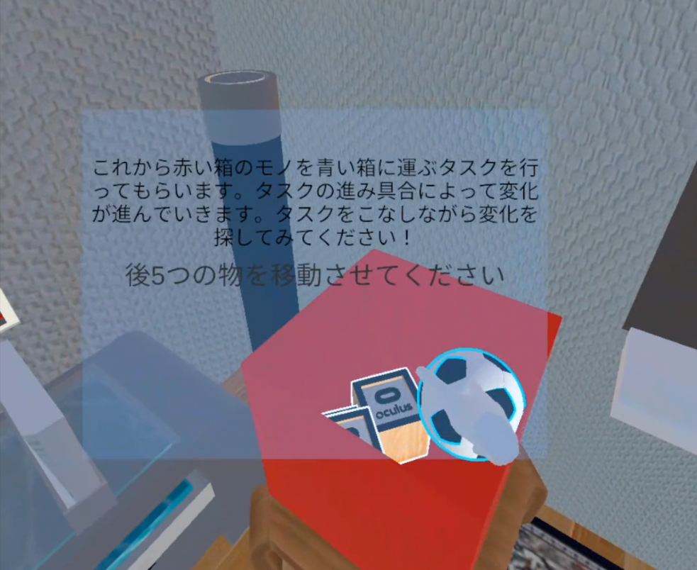

# VR AHA
学部3年時に作成したVRゲーム。チーム製作。改良したものを2022年岐阜大学祭で展示を行った。

## 概要
プレイヤーは簡単なタスクを行いながら、VR空間で変化するオブジェクトや異変を見つけるゲーム。変化の大きさはタスクの進行度合いで決まる。写真の一部が徐々に変化する「**アハ体験**」から発想を得ている。

## 使用したもの
- ゲームエンジン : Unity
- 開発言語 : C#
- HMD : Oculus Quest / Oculus(Meta) Quest 2

## 作品が提供する価値
- VR空間を動き回ることができることから生じる多面的な観察
- タスクを行うことにより生じる「**アフォーダンス**」の変化

から生まれる「**閃き・気づき**」

これは、写真などのアハ体験から生じない要素である。

### アフォーダンス
ギブソンによって提唱されたが概念。環境がそこに生活する動物に対してアフォード（提供する）「価値」や「意味」のこと。（日本大百科全書より）

左の場合、障害物が男の子より低いため、男の子は無意識に「上から乗り越えよう」とするが、右の場合は、障害物が男の子より高いため、無意識に「下からくぐろう」とする。このように、環境が人に与える価値や意味をアフォーダンスと呼ぶ。

## 大変だったところ
- VR開発の環境構築
- アフォーダンスを感じられるような企画・変化を考えること

プレイヤーに「タスク」を行わせることは、アフォーダンスを感じる機会を作るために導入した

## 動画
<iframe width="560" height="315" src="https://www.youtube.com/embed/dPdiliWH9JY" title="YouTube video player" frameborder="0" allow="accelerometer; autoplay; clipboard-write; encrypted-media; gyroscope; picture-in-picture; web-share" allowfullscreen></iframe>