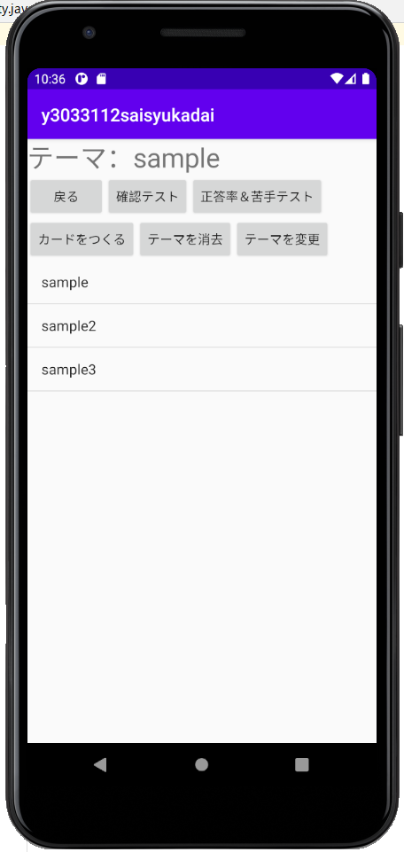
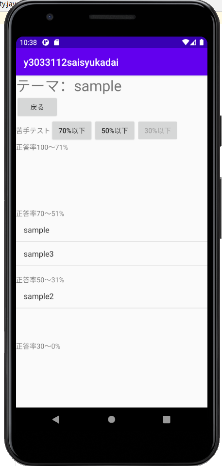

# Flashcard App
学部3年時に作成したAndroidの単語帳アプリ

[ソースコード](https://github.com/sny0/FlashcardApp)

## 特徴
- 自分で単語カードを作成できる
- データベースで情報を管理しており、アプリを終了させてもデータは消えない
- 確認テスト機能を実装し、単語カード毎に正答率を記録できる
- 苦手テスト機能を実装し、確認テストでの正答率が低い単語のみの確認テストができる

# 使用したもの
- Android Studio
- 開発言語 : Java

## 大変だったところ
- データベース（SQLite）の実装
- 動的なListViewの実装

## 動画
<iframe width="560" height="315" src="https://www.youtube.com/embed/f055C8vfP5Q" title="YouTube video player" frameborder="0" allow="accelerometer; autoplay; clipboard-write; encrypted-media; gyroscope; picture-in-picture; web-share" allowfullscreen></iframe>