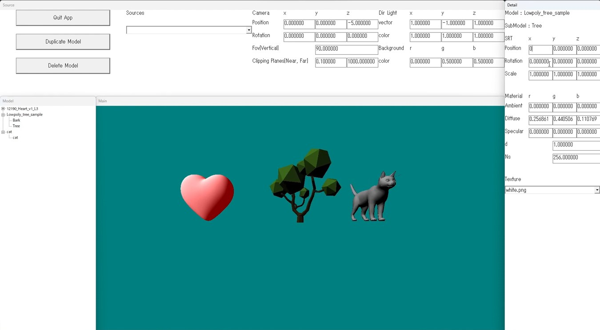

# OBJFileViewer
DirectX12を使用し、OBJファイルやMTLファイルをパースし3Dモデルを描画するビュアーを制作。

[GitHubリポジトリ](https://github.com/sny0/OBJFileViewer)

[操作説明](https://github.com/sny0/OBJFileViewer/blob/main/OBJFileViewer_%E8%AA%AC%E6%98%8E.pdf)

## 使用したもの
- API : DirectX12, Win32API
- ライブラリ : DirectXTex
- 開発言語 : C++, HLSL
- OS : Windows11
- GPU : NVIDIA GeForce RTX 3060

## 参考にしたもの
- [Microsoft リファレンス](https://learn.microsoft.com/ja-jp/training/)  
    DirectX12の関数の扱い方、WindowsAPIの扱い方について
- DirectX12の魔導書 3Dレンダリングの基礎からMMDモデルを躍らせるまで, 川野竜一, 翔泳社  
    DirectX12の概要・扱い方、ポリゴンの表示やマテリアルの実装
- HLSLシェーダーの魔導書 シェーディングの基礎からレイトレーシングまで, 清原隆行, 翔泳社  
    CGの概念、HLSLについて
- [もんしょの巣穴 DirectXの話](https://sites.google.com/site/monshonosuana/directx%E3%81%AE%E8%A9%B1)  
    DirectX12の概念について
- [ぬの部屋（仮） Win32APIでウィンドウをカプセル化](https://suzulang.com/win32api%E3%81%A7%E3%82%A6%E3%82%A3%E3%83%B3%E3%83%89%E3%82%A6%E3%82%92%E3%82%AB%E3%83%97%E3%82%BB%E3%83%AB%E5%8C%96/)  
    ウィンドウプロシージャ関数の継承について
- [EternalWindows](https://eternalwindows.jp/index.html#windevelop)  
    ウィンドウの生成、ボタンやボックスの生成・変更など
    
## 動画

- [2023/10/30] Ver1が完成しました。

<iframe width="560" height="315" src="https://www.youtube.com/embed/d9WwkKsKSzY?si=yQMb2qMZGSErVfvl" title="YouTube video player" frameborder="0" allow="accelerometer; autoplay; clipboard-write; encrypted-media; gyroscope; picture-in-picture; web-share" allowfullscreen></iframe>

- [2023/9/11] マテリアルとPhongの反射モデルを実装しました。

<iframe width="560" height="315" src="https://www.youtube.com/embed/mjz2uXiGsEg?si=1sIai6hRPAA9mSbV" title="YouTube video player" frameborder="0" allow="accelerometer; autoplay; clipboard-write; encrypted-media; gyroscope; picture-in-picture; web-share" allowfullscreen></iframe>

↓鏡面反射率が高いversion

<iframe width="560" height="315" src="https://www.youtube.com/embed/Ctz0JRySegQ?si=CcvyWdK2aLy0AA6b" title="YouTube video player" frameborder="0" allow="accelerometer; autoplay; clipboard-write; encrypted-media; gyroscope; picture-in-picture; web-share" allowfullscreen></iframe>

- [2023/9/3] テクスチャを貼れるようになりました。

<iframe width="560" height="315" src="https://www.youtube.com/embed/TUSzngICLHE?si=4CEpNZ-zAuZurPwU" title="YouTube video player" frameborder="0" allow="accelerometer; autoplay; clipboard-write; encrypted-media; gyroscope; picture-in-picture; web-share" allowfullscreen></iframe>

