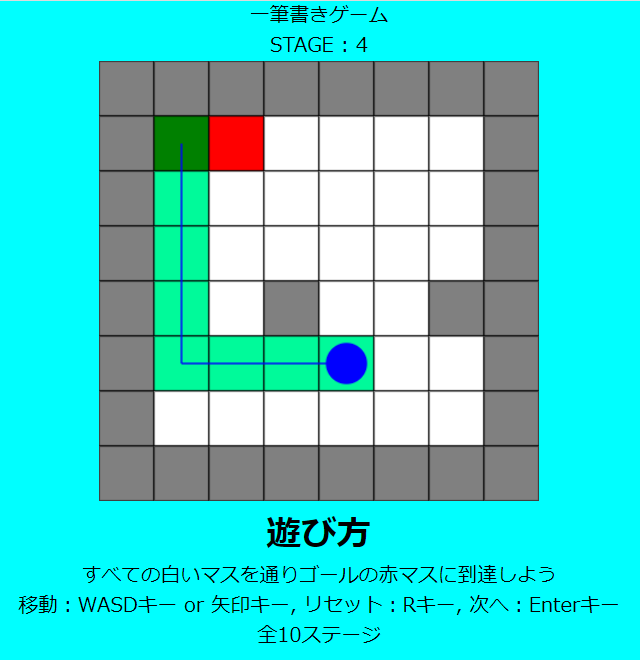

# 一筆書きゲーム
JavaScriptを勉強したため、簡単なゲームを作ってみた。

製作期間（JavaScriptの勉強時間と合わせて）3, 4日

[**ここからプレイできます**](https://sny0.github.io/OneStrokeGame_js/)

[GitHubリポジトリ](https://github.com/sny0/OneStrokeGame_js)

## 主に参考にしたもの
- JavaScriptの勉強 : [Progate](https://prog-8.com/)
- HTMLのcanvasタグとJavaScriptを用いた描画 : [MDN Web Docs](https://developer.mozilla.org/ja/docs/Web/API/Canvas_API)