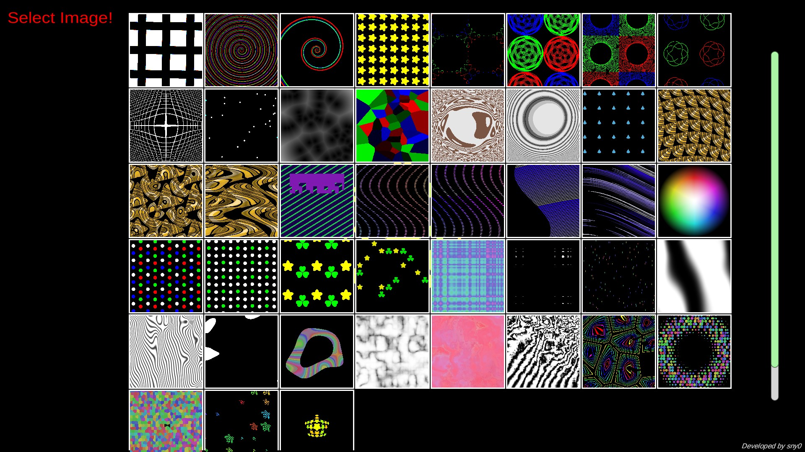

# ShaderArts
shaderでお絵描き！  
Tank2の制作時にshaderを書くことに夢中になり、shaderの作品を作ることに。  
作り始めて一週間ちょっとで40作品以上制作。

[ここからプレイできます！](https://sny0.github.io/ShaderArts_play/)

[GitHubリポジトリ](https://github.com/sny0/ShaderArts)

## 使用したもの
- Unity(ver.2021.3.16f1)
- C#, ShaderLab

## 参考にしたもの
- [楽しい！Unityシェーダー お絵描き入門！](https://docs.google.com/presentation/d/1NMhx4HWuNZsjNRRlaFOu2ysjo04NgcpFlEhzodE8Rlg/edit#slide=id.g423da70889_217_0)
- [The Book of Shaders](https://thebookofshaders.com/)