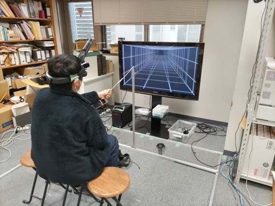

# 運動視できる立体視映像の作成
研究室仮配属時に作成した作品。改良したものを2022年岐阜大学祭で展示を行った。

見る人が動いても見える物体の場所は変化しない、つまり正しい運動視差があることを研究室では「運動視」と呼んでいる。

[ドキュメント](http://www.kzm.info.gifu-u.ac.jp/contents/B3Project2021.pdf)

[学祭展示でのポスター](http://www.kzm.info.gifu-u.ac.jp/contents/popOutObjectPoster.pdf)

## 概要
HTC VIVEのコントローラーが括りつけられたヘッドセットを被ると、飛び出した物体が見える。さらに、ユーザーが動いても仮想物体の場所は移動しない。仮想物体が同じ位置にとどまっているように見える。

## 使用したもの
- ゲームエンジン : Unity
- 開発言語 : C#
- SteamVR Plugin(Unityのアセット)
- HTC VIVE(HMD)
- アクティブシャッターメガネ
- 3Dテレビ

## 動画
春祭2024で展示したときに撮影した。
<iframe width="560" height="315" src="https://www.youtube.com/embed/q7bqP6noDqQ?si=eOOf-yxqASqDrgg5" title="YouTube video player" frameborder="0" allow="accelerometer; autoplay; clipboard-write; encrypted-media; gyroscope; picture-in-picture; web-share" referrerpolicy="strict-origin-when-cross-origin" allowfullscreen></iframe>

## 秘話
私の研究室では、仮配属された学部3年生時に先生から課題が与えられる。私の代では、「**3Dテレビを使って、見る人が動いても見える物体の場所は変化しないようなものをつくる**」ことがお題だった。

実装方法や使用機器は自由であり、全部自分たちで考える必要がある。始めは、何をしたらよいか分からなかったため、視覚とは何か、なぜ人は世界を見れるのかを考える・調べることから始めた。運動視させるためにはどうしたら良いかを物凄く考えた。現実世界と仮想世界の位置合わせをすれば、解決できることを思いつく、確信するには時間がかかった。ユーザーの座標を得る方法も試行錯誤した。Nintendo SwitchのJoy-Conを使ってみたが、ズレが大きくてうまくいかなかったため、HTC VIVEを使うことにした。Unityの物理カメラを扱うために、カメラの勉強をした。

大変苦労して作成したが、得られたものはとても大きかった。光学や視覚の知識は、私がずっと疑問だった、「見る」ことについての疑問を晴らせてくれ、その分野への興味を持たせてくれた。私は、この経験がなかったら、今の研究テーマを選んでいないだろうし、研究の実験環境をつくることが出来なかっただろう。この経験は、私の礎となっている。(2023/4/3記述)