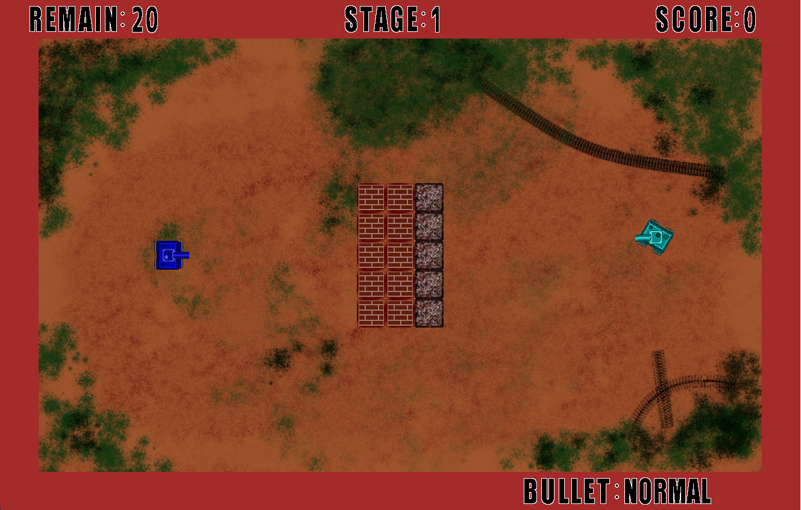

# Tank
学部2年時に作成した2D戦車ゲーム

[ソースコード](https://github.com/sny0/Tank)

## 特徴
- 自機は、2種類の弾と爆弾を使うことができる
- 4種類の異なる敵が登場

## 使用したもの
- 開発言語 : Java

## 大変だったところ
- 壁に機体がめり込まないようにアルゴリズムを考えること
- 敵AIの作成

### 弾・爆弾について
- **通常弾** :  まっすぐ飛ぶ弾。壁や障害物に反射すると一度跳ね返る。自機・敵機ともに画面内に5発発射できる。通常弾同士が衝突すると相殺する。

- **打上弾** : 弾を上に打ち上げる。着弾すると大爆発する。自機は飛ぶ距離が固定だが、敵機は自機の場所に着弾するように速さを変えて発射する。自機は画面内に1発、敵機は2発発射できる。レンガブロックを壊すことが出来る。

- **爆弾** : 一定時間経つか、弾や爆弾に当たると爆発する。自機のみ設置が可能で、画面内に3個設置できる。レンガブロックを壊すことが出来る。

### 障害物について
- **レンガブロック** : 打上弾や爆弾によりこわすことができる
- **鉄ブロック** : 壊すことができない

### 敵機について
- **緑色** : 一番弱い敵。移動速度が遅く、通常弾のみ撃つ。
- **茶色** : 動かないが、打上弾を撃つ。放置すると厄介。
- **白色** : 一定時間透明になる。通常弾のみ撃つ。移動速度が少し速く、弾のディレイタイムも短い。
- **紫色** : 一番強い敵。反射しない高速の通常弾を撃つ。通常弾が当たらないと判断すると打上弾を撃つ。移動速度が速く、弾のディレイタイムも短い。

## 動画
- 操作
<iframe width="560" height="315" src="https://www.youtube.com/embed/9gBqAQvw_og" title="YouTube video player" frameborder="0" allow="accelerometer; autoplay; clipboard-write; encrypted-media; gyroscope; picture-in-picture; web-share" allowfullscreen></iframe>

- プレイ動画 short version
<iframe width="560" height="315" src="https://www.youtube.com/embed/eI4C9eYoNpM" title="YouTube video player" frameborder="0" allow="accelerometer; autoplay; clipboard-write; encrypted-media; gyroscope; picture-in-picture; web-share" allowfullscreen></iframe>

- プレイ動画 long version
<iframe width="560" height="315" src="https://www.youtube.com/embed/Vimc_ktj4Lw" title="YouTube video player" frameborder="0" allow="accelerometer; autoplay; clipboard-write; encrypted-media; gyroscope; picture-in-picture; web-share" allowfullscreen></iframe>

- 敵機の通常弾
<iframe width="560" height="315" src="https://www.youtube.com/embed/Vk-mnmZUd1s" title="YouTube video player" frameborder="0" allow="accelerometer; autoplay; clipboard-write; encrypted-media; gyroscope; picture-in-picture; web-share" allowfullscreen></iframe>

- 敵機の打上弾
<iframe width="560" height="315" src="https://www.youtube.com/embed/L7jGhdCZLx4" title="YouTube video player" frameborder="0" allow="accelerometer; autoplay; clipboard-write; encrypted-media; gyroscope; picture-in-picture; web-share" allowfullscreen></iframe>
