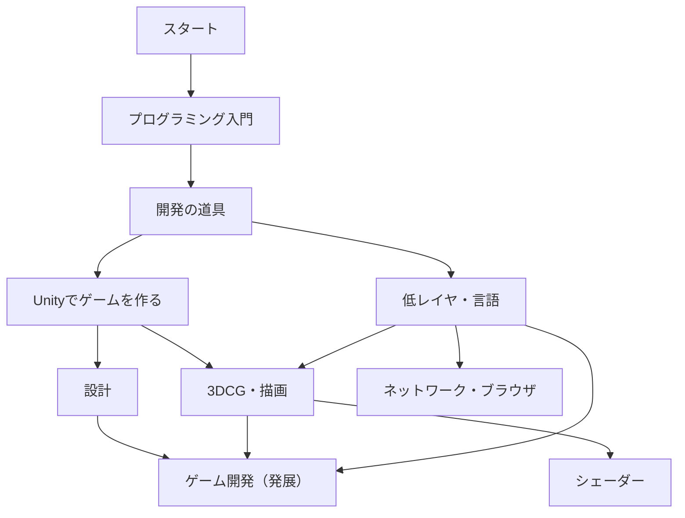

<StudyStart>

```mermaid
flowchart TD
  S["スタート"] --> P["プログラミング入門"]
  P --> T["開発の道具"]
  T --> U["Unityでゲームを作る"]
  T --> L["低レイヤ・言語"]
  U --> D["設計"]
  U --> R["3DCG・描画"]
  R --> H["シェーダー"]
  L --> R
  L --> W["ネットワーク・ブラウザ"]
  D --> G["ゲーム開発（発展）"]
  R --> G
  L --> G
```

</StudyStart>
